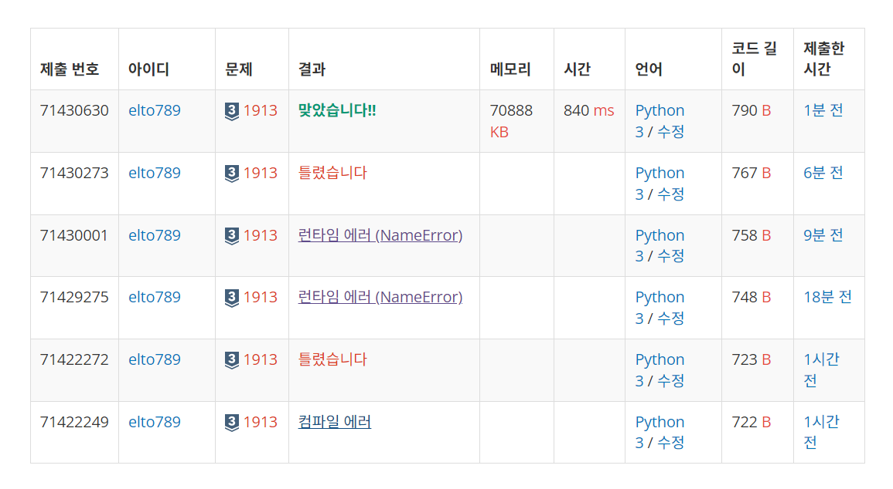

# 백준 1913번

## 접근

n\*n의 배열의 중앙에서 시작하면서 이동하며 숫자를 채워나가는 방식
<br>
여기까지는 생각했지만 어떻게 채워나가야 하는지 몰라서 찾아봤으나 다 이해가 안되었음

### 방향 설정

```python
# 우, 하, 좌, 상
dx = [0, 1, 0, -1]
dy = [1, 0, -1, 0]
```

해결한 코드를 보면 방향 설정하는 것도 이해가 잘 안되었는데 현재 내가 만든 배열은 2차원 배열이라서 `n_list[x][y]` 라고 할 때 반대로 생각했어야 했다.

```python
dx = [1, 0, -1, 0]
dy = [0, 1, 0, -1]
```

우 -> dx[0]: 1 증가, dy[0]: 변화 x <br>
하 -> dx[1]: 변화x, dy[1]: 1 증가 (이것도 처음에는 1 감소로 생각했다.) <br>
좌 -> dx[2]: 1 감소, dy[2]: 변화 x <br>
상 -> dx[3]: 변화x, dy[3]: 1 감소 (이것도 처음에는 1 증가로 생각했다.) <br>

그래서 처음에는 이렇게 생각했었는데 이렇게 작성하면 `n_list[y][x]`로 바꾸어서 생각해야 한다.

### 채우기

```python
while True:
    for i in range(4):
        for _ in range(len):
            x += dx[i]
            y += dy[i]
            num += 1
            n_list[x][y] = num
            if num == m:
                ans = [x+1, y+1]

    if x==y==0:
        break
    x -= 1
    y -= 1
    len += 2

```

전체 방향 (4방향)에 대해 루프를 진행하고 하나의 루프가 끝나면 길이를 2씩 증가해 나선형으로 만든다.
<br>
그리고 1씩 감소한 이유는 루프 종료의 조건을 위해 만들어 둔 것 같다.

## 문제

m이 1인 경우는 ans를 대입하는 과정없이 출력하므로 런타임에러(NameError)가 난다.

그래서 아래와 같이 처리를 했다.

```python
if m == 1:
    ans = [x+1, y+1]
```


난리부르스치고 맞았다.

#### 참고 블로그

https://www.acmicpc.net/problem/1913
